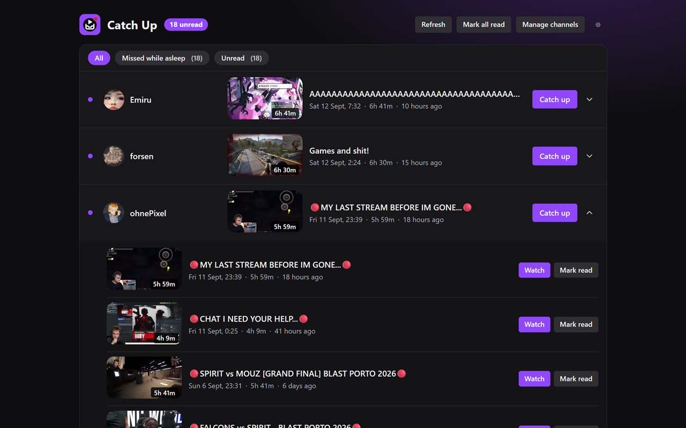
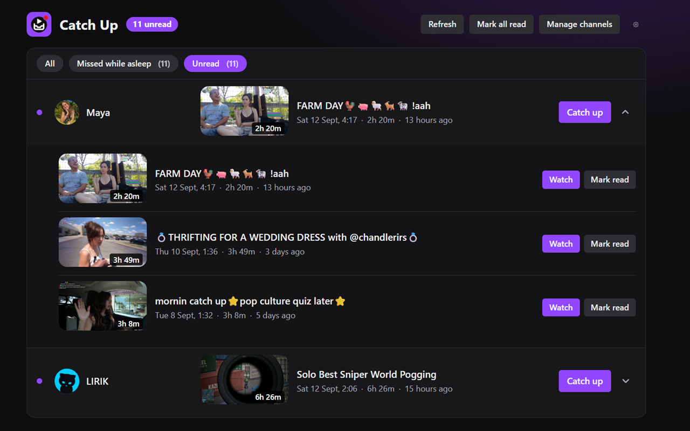
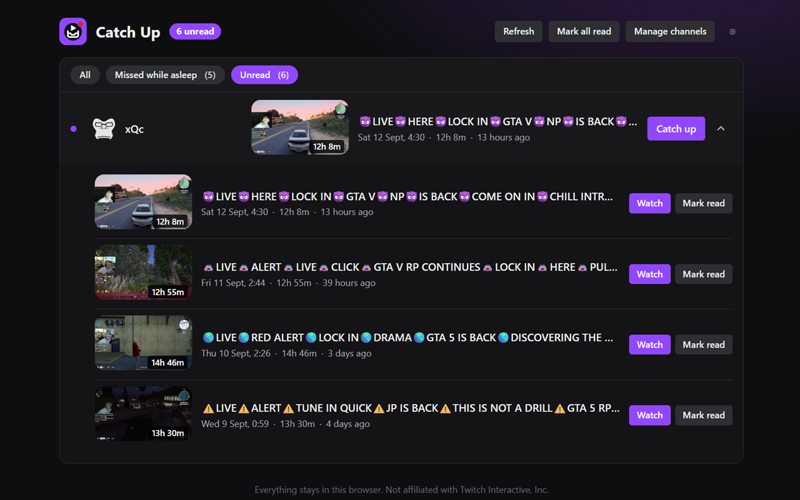
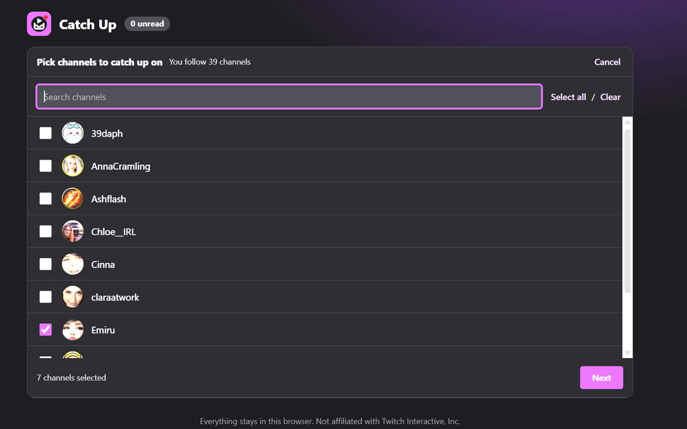
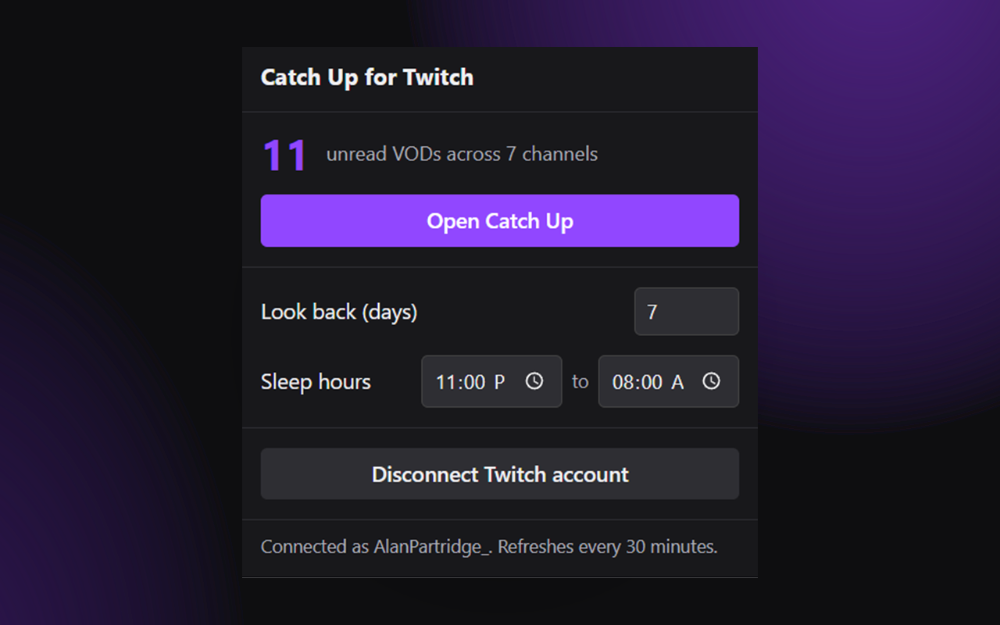

# Catch Up for Twitch

**Your favourite streamers go live while you're asleep. Twitch shows you a
wall of VODs and no way to tell which ones you've already seen.**

This extension turns that into an inbox: pick the channels you care about,
see every VOD from the last few days in one list, tick off what you've
watched, and jump back into a stream exactly where you left off.

<b>The inbox.</b> Newest VOD per channel, a purple dot until you've
watched it, ticks on the ones you have.

---

## What it does

- One row per channel, newest VOD first, with a purple dot until you've
  caught up
- Each row shows the latest unwatched VOD: thumbnail, title, when it aired
  in **your** timezone, how long it ran, and how long ago
- **Catch up** opens the VOD in a new tab and, if you've started it before,
  resumes from where you stopped
- Expand a row to see every VOD in the window, each with its own **Watch** and
  **Mark read** buttons
- A red **LIVE** pill when the channel is streaming right now
- Filters: **All**, **Missed while asleep** (streams that overlapped your
  sleep hours), **Unread**, and **Saved**
- **Save for later**: hit the bookmark on any VOD to keep it in the Saved
  tab, even after it drops out of the window or you untick the channel
- Every VOD shows when Twitch will delete it (7, 14 or 60 days depending on
  the channel), turning amber inside the last two days; the Saved tab sorts
  soonest-to-expire first and labels anything already gone
- Toolbar badge shows the unread count and refreshes every 30 minutes
- Channels with VODs turned off, or that no longer exist, are labelled rather
  than silently dropped

Sibling project of
[Uptime Badges for Twitch](https://github.com/Brownaye/uptime-badges-for-twitch),
and built to look like it.

## A look around

<table>
  <tr>
    <td width="50%">
      
       <b>Expand a row</b> to see every VOD in the window, each with its own Watch and Mark read.
    </td>
    <td width="50%">
      
       <b>Filters</b> for All, Missed while asleep, and Unread.
    </td>
  </tr>
  <tr>
    <td width="50%">
      
       <b>Pick channels</b> from your follow list. Search, tick, Next.
    </td>
    <td width="50%">
      
       <b>The popup</b> shows your unread count and holds the quick settings.
    </td>
  </tr>
</table>

## Settings

Quick settings live in the toolbar popup and in the gear on the inbox page.

- **Look back (days)** — how far back the inbox reaches, 1 to 60 days
  (default 7)
- **Sleep hours** — start and end of your usual sleep, used by the "Missed
  while asleep" filter (default 23:00 to 08:00, local time)
- **Manage channels** — change which followed channels appear in the inbox
- **Mark all read** — clear the inbox in one click

## Install

### From the Chrome Web Store — recommended

One click and you're set — this is the right way to install for everyone who
isn't editing the code, because updates then arrive automatically. If you want
to run or modify the source instead, use the developer instructions below.

### Load unpacked — for developers

> **This path is for people who want to run or modify the source.**
> It doesn't auto-update, and Chrome will show a "developer mode extensions"
> warning on every startup.

1. Download the latest `catch-up-for-twitch-<version>.zip` from
   [Releases](https://github.com/Brownaye/catch-up-for-twitch/releases) and
   unzip it, or clone this repository
2. Open Chrome and go to `chrome://extensions`
3. Turn on **Developer mode** (top-right toggle)
4. Click **Load unpacked**
5. Select this project folder (the one containing `manifest.json`)

The extension will appear in your extensions list and toolbar, and a welcome
page opens. After changing any code, return to `chrome://extensions` and click
the refresh icon on the extension's card to reload it.

There is no build step: the folder is loaded as-is. Vanilla JavaScript, HTML
and CSS only.

## Connecting your Twitch account

**The inbox stays empty until you connect a Twitch account.** This is a
one-time standard Twitch login, and it's a requirement of Twitch's API rather
than a choice — the endpoints that list who you follow and what they've
broadcast only answer authenticated requests.

The extension asks for a single read-only scope (`user:read:follows`). It never
sees your password: the login happens on Twitch's own domain, and Twitch hands
back an access token that is stored only in your browser. You can disconnect
from the popup at any time, or revoke access entirely under **Connections** in
your Twitch account settings.

If the token expires, the extension tries to renew it silently. If that fails
you'll see a red **!** on the toolbar icon and a **Reconnect** banner on the
inbox page.

## Permissions

| Permission | Why it's needed |
| --- | --- |
| `identity` | Runs the Twitch login flow and receives the access token |
| `storage` | Saves your channel list, settings, watched VODs and resume positions locally |
| `alarms` | Wakes the extension every 30 minutes to refresh the unread badge |
| `api.twitch.tv` | Asks for your follow list, each channel's VODs, and who is live |
| `id.twitch.tv` | Handles the login itself |
| `www.twitch.tv` | Lets the resume-position script run on VOD pages |

There is no `tabs` permission (opening a VOD in a new tab doesn't need one),
no analytics, and no remote code. The only servers the extension ever contacts
are Twitch's own.

## Privacy

No servers, no tracking, no data collection. The access token, your channel
list, your settings and your watch history stay in your browser's local
extension storage, and uninstalling removes them.

See **[PRIVACY.md](./PRIVACY.md)** for the full policy.

## Project structure

| File | Role |
| --- | --- |
| `manifest.json` | Extension manifest (Manifest V3) |
| `background.js` | Service worker — Twitch OAuth, Helix requests, VOD cache, refresh alarm, badge |
| `app.html` / `app.js` | The main page: channel picker (screen 1) and inbox (screen 2) |
| `popup.html` / `popup.js` | Toolbar popup — unread count, launcher, quick settings |
| `welcome.html` / `welcome.js` | First-run onboarding page |
| `content.js` | Runs on `twitch.tv/videos/*` to save resume positions and mark VODs watched |
| `theme.css` | Shared colours, type and controls (matches Uptime Badges) |
| `icons/` | Extension icons, plus `make-icons.ps1` which generates them |
| `store/` | Web Store screenshots, promo tiles, listing text and the scripts that build them |
| `CLAUDE.md` | Architecture notes and project rules for AI-assisted sessions |

## How it works

The inbox page asks the service worker for the follow list
(`/channels/followed`, paged 100 at a time), then for the ticked channels it
fetches archive VODs (`/videos?type=archive`, four channels at a time), live
status (`/streams`, 100 ids per request) and display names and avatars
(`/users`, 100 ids per request). Results are cached for five minutes, and
avatars for a day. VODs are filtered to the lookback window on the client, so
changing the window doesn't refetch anything.

"Watched" is a per-VOD flag in local storage. It's set when you click
**Catch up** or **Watch**, when you press **Mark read**, or when the content
script sees playback pass 90% of the VOD. The content script also saves the
player's position every 15 seconds, and **Catch up** appends it to the URL as
`?t=1h2m3s` so Twitch resumes from that spot. Watched flags and resume
positions older than 90 days are pruned on startup.

"Missed while asleep" checks whether a stream's live window (start time plus
duration) overlapped your sleep hours on any local calendar day it touched.
All times are rendered with `Intl.DateTimeFormat` in the browser's timezone.

The `key` field in `manifest.json` pins the extension ID so the Twitch OAuth
redirect URL (`https://<id>.chromiumapp.org/`) is the same whether the
extension is loaded unpacked or installed from the store.

## Store assets

Everything for the Chrome Web Store listing lives in `store/`: the five
1280×800 screenshots, the 440×280 and 1400×560 promo tiles, and the listing
text with the permission justifications. Two PowerShell scripts rebuild the
images with no extra tooling: `make-promo.ps1` draws the tiles, and
`stitch-screenshot.ps1` / `fit-screenshot.ps1` turn any browser capture into
a 1280×800 24-bit PNG.

---

Not affiliated with Twitch Interactive, Inc.
